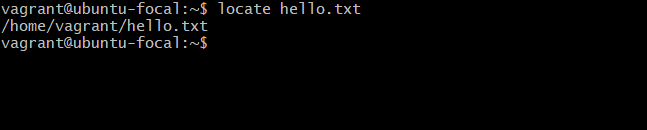
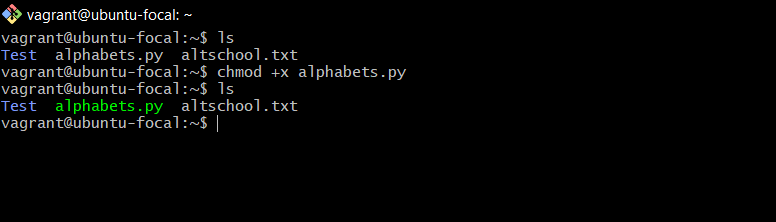
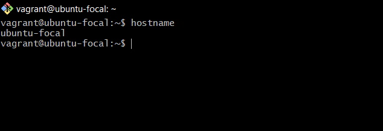
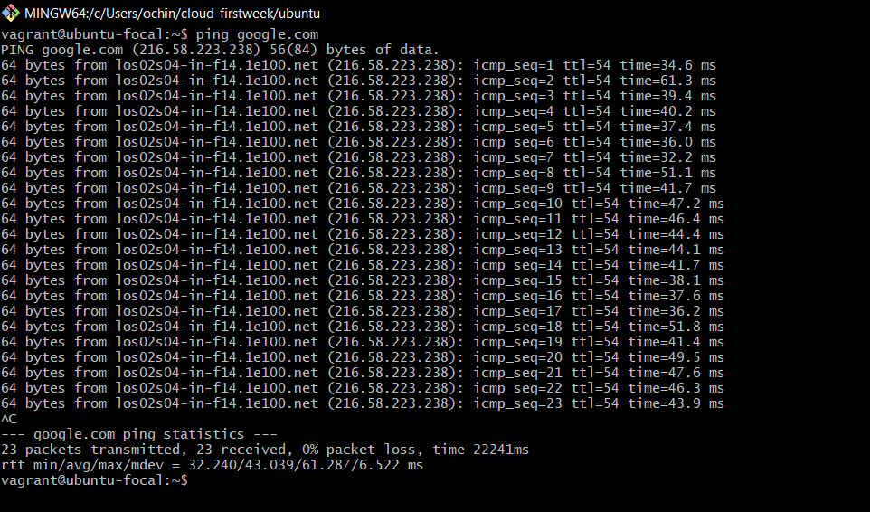
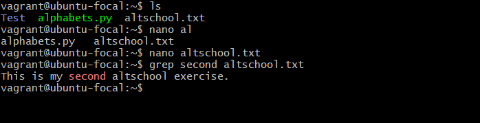
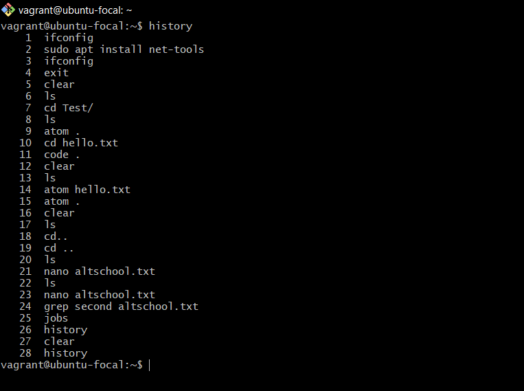
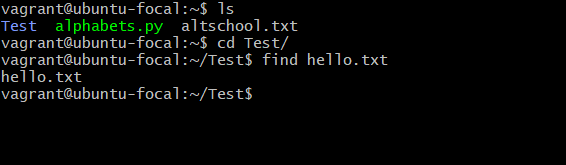
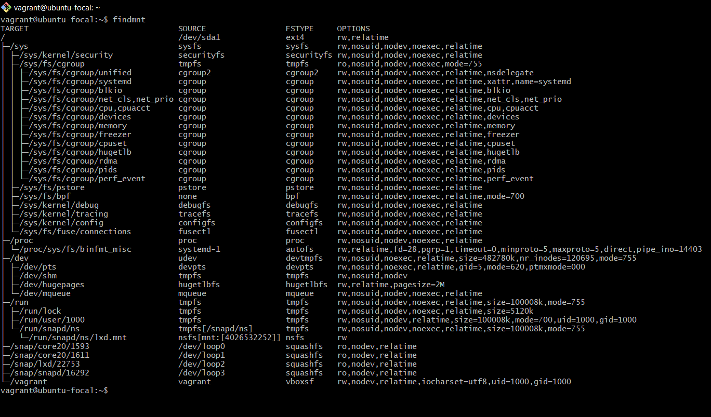
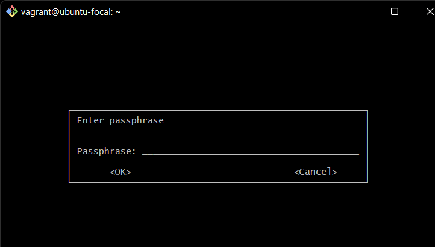
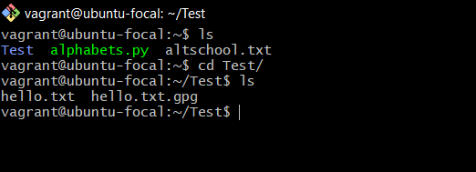

# 10 "more" Linux Commands

<ol>
<li>Locate: The locate command is used to locate a file in a Linux system. Similar to the search command in Windows.</li>

<li>du: du is used to know the disk usage of a file in your system. For example, if you want to know the disk space used by a aprticular folder in Linux, you can use the command “du FOLDERNAME”.</li>

<li>chmod: chmod is used to make a file executable and to change the permissions granted to it in Linux. Imagine you have a python code named alphabets.py in your computer. You'll need to run “python alphabets.py” every time you need to run it. Instead of that, when you make it executable, you'll just need to run “alphabets.py” in the terminal to run the file. You can use “chmod 755 numbers.py” to give it root permissions or “sudo chmod +x numbers.py” for root executable. </li>

<li>hostname: hostname is used to know your name in your host or network. Basically, it displays your hostname.</li>

<li>ping: ping is used to check your connection to a server. Simply, when you type in, for example, “ping google.com”, it checks if it can connect to the server and come back. It measures this round-trip time and gives you the details about it. The use of this command for simple users like us is to check your internet connection. If it pings the Google server (in this case), you can confirm that your internet connection is active.</li>

<li>grep: This command lets you search through all the text in a given file. For example, grep second altschool.txt will search for the word second in the altschool file. Lines that contain the searched word will be displayed fully.</li>

<li>history: When you’ve been using Linux for a certain period of time, you’ll quickly notice that you can run hundreds of commands every day. As such, running history command is particularly useful if you want to review the commands you’ve entered before.</li>

<li>find: Similar to the locate command, using find also searches for files and directories. The difference is, you use the find command to locate files within a given directory.</li>

<li>findmnt: This displays/shows target mount point
for all filesystems.</li>

<li>gpg -c: This is used to encrypt a file. In contrast gpg is used to decrypt a file. "hello.txt gpg"</li>

</ol>